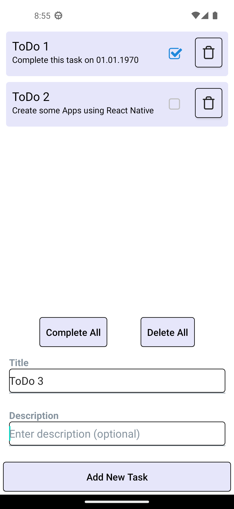

# README

This repo implements an example ToDo app using React Native and expo to show of the usage
of react-native-async-storage.

This app uses [react-native-async-storage](https://github.com/react-native-async-storage/async-storage)
and [react-native-elements](https://reactnativeelements.com/) as dependencies.

